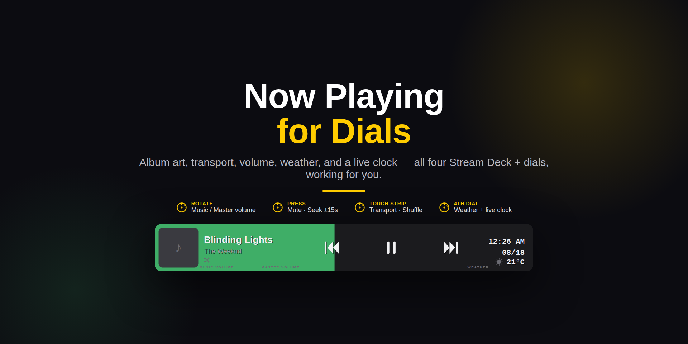
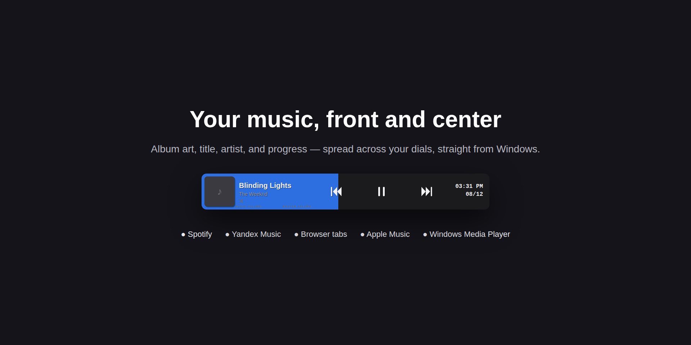
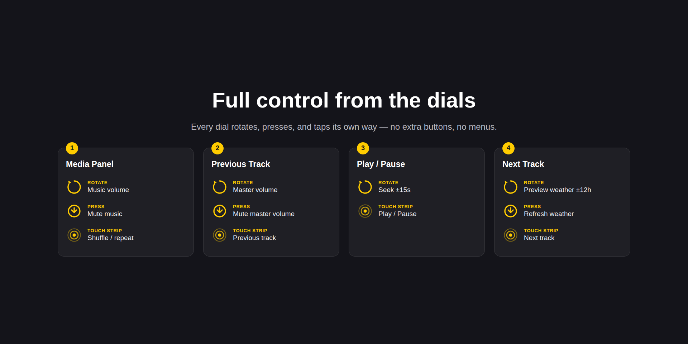
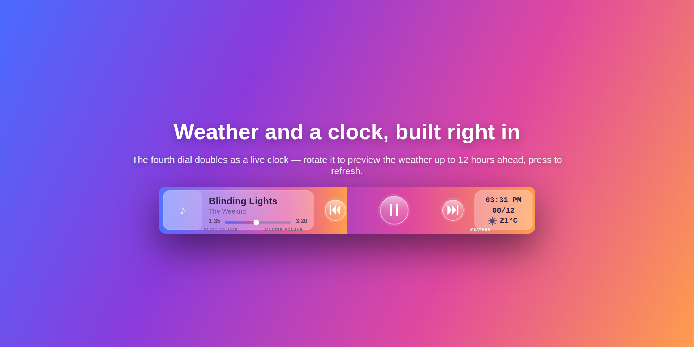
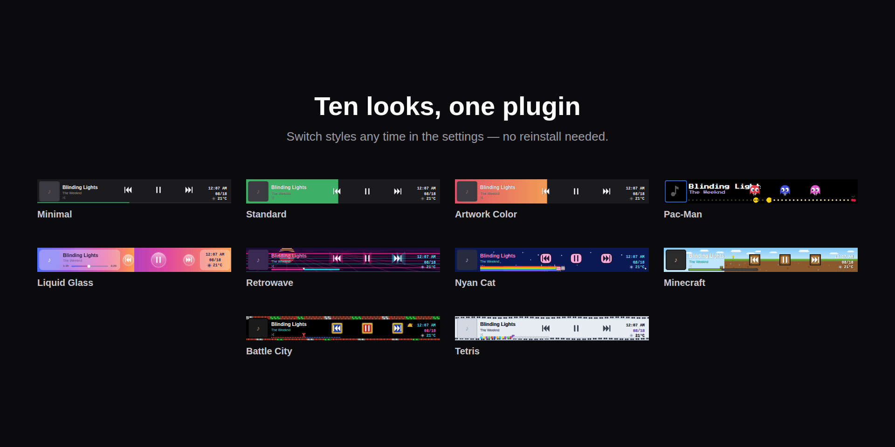
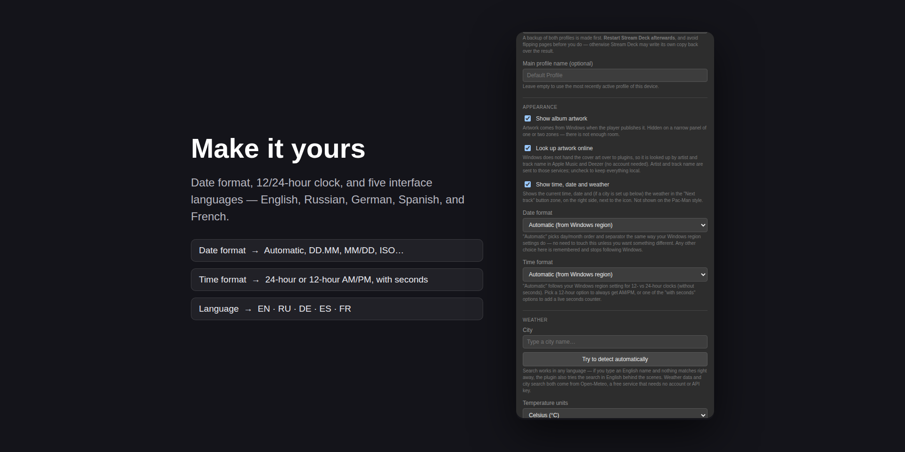

# Now Playing for Dials

A Stream Deck + plugin that turns your four dials and touch strip into a full-width **Now Playing** panel: album art, title, artist, and progress at a glance — plus real transport, volume, seek, shuffle/repeat, weather, and a live clock, all controlled right on the dials.

This repository is the documentation and feedback hub for the plugin — it does not contain the plugin's source code. **Now Playing for Dials** is a commercial plugin, available through the Elgato Marketplace.

It reads straight from Windows' own now-playing info (System Media Transport Controls) — the same standard API the OS's own media overlay uses — so it works with virtually any player out of the box: Spotify, Yandex Music, Apple Music, VK Music, browser tabs (YouTube included, with its own video thumbnail), Windows Media Player, and more. No account, no API key, nothing to configure to get started.

- [Installation](#installation)
- [Pick the setup that matches how you use your Dials](#pick-the-setup-that-matches-how-you-use-your-dials)
- [Features](#features)
- [Progress bar styles ("skins")](#progress-bar-styles-skins)
- [Settings reference](#settings-reference)
- [Known limitations](#known-limitations)
- [Feedback and suggestions](#feedback-and-suggestions)
- [License](#license)

## Installation

1. Open the Stream Deck app, go to the **Marketplace** tab, and search for **Now Playing for Dials** (or install it from its Elgato Marketplace listing page).
2. Once installed, a new **Now Playing** category appears in the action list, and a bundled **Now Playing** profile installs automatically.
3. **Important:** in Stream Deck's profile list (Settings → Profiles), do **not** check "Make this my default profile" for the **Now Playing** profile. That checkbox isn't part of the plugin's own settings — it's a separate Stream Deck flag that's easy to tick by accident when the profile is sitting right there in the list. If it's checked, Stream Deck will always load "Now Playing" on device connect instead of your regular profile; the plugin is built to switch to it briefly and switch back on its own, not to stay loaded permanently.
4. Pick the usage pattern that fits you from the section right below, and configure auto-show (or don't) accordingly.

Requires Stream Deck 6.5+ and Windows 10/11.

## Pick the setup that matches how you use your Dials

**Heavy Dials user, different profiles for different apps?**
Give the panel its own dedicated **"Now Playing"** profile and turn on **auto-show** (10 seconds by default, in the action's settings). It pops up the instant a track changes, gives you a glance and a tap of control, then hands your dials straight back to whatever mixer or profile you were using — you never lose your place.

**Rarely touch your Dials?**
Skip the extra profile entirely — drop the Media Panel action straight onto your default profile's four dials and leave it up permanently (leave auto-show off, which is the default). It's always there when you glance down, and never demands attention otherwise.

**Use Dials occasionally, mostly for volume?**
Put the panel on a second page of your existing profile. Swipe over to it whenever you want media controls in front of you, and swipe back the moment you're done — no profile-switching, no auto-show needed.

## Features

- **One continuous panel across all four dials** — album art, title, artist, and a progress bar, auto-sizing down to fewer zones if that's all you've got. With fewer than four zones the art and fonts shrink to fit, and on the narrowest layouts the time counter (and then the artwork) is dropped for lack of space.
- **Works with almost anything** — reads Windows' System Media Transport Controls, so it never fights other apps for the same now-playing data.

- **Full transport control** — tap the touch strip or press a dial to skip previous/next or toggle play/pause; the icon always reflects the player's real state, and every button flashes briefly on press for feedback.
- **Seek ±15 seconds** — rotate the third dial to jump forward or back without touching your mouse.
- **Shuffle / repeat cycling** — tap the touch strip on the first dial to cycle off → shuffle → repeat-all → repeat-one.
- **Per-app music volume** on the first dial — rotate to adjust, press to mute.
- **Windows master volume** on the second dial — same rotate/press pattern, kept independent from the app volume.

- **Weather, right on the fourth dial** — rotate for a ±12-hour preview in 30-minute steps, press to refresh, always doubling as a live clock with your choice of 12/24-hour format.
- **Online artwork lookup** for players that don't publish their own cover art (common for a lot of Windows apps) — pulled by artist + track name via Apple Music/Deezer, no account required, and fully optional.
- **Auto-show that gives your Dials back** — pops up on track change, extends itself if you press a button, and always returns control the moment you touch a dial, pause, or close the player.
- **Profile page sync** — copies your existing pages into the "Now Playing" profile, so switching to it briefly doesn't hide the rest of your layout (see the known limitation below).
- **Genuinely localized** — interface in English, Russian, German, Spanish, or French, plus independent date format, time format, and encoder-label visibility settings.

## Progress bar styles ("skins")

The progress bar is fully re-skinnable, and this is where the plugin keeps growing. Currently available:

**Minimal**, **Standard**, **Artwork Color**, **Pac-Man** (a real animated sprite chomping down the progress trail), **Liquid Glass**, **Retrowave**, **Nyan Cat**, **Minecraft**, **Battle City**, and **Tetris** — each a genuinely different look, not just a recolor. Switch any time in the action's settings, no reinstall needed. More are planned.

## Settings reference

All settings live on the Media Panel action's Property Inspector:

**Auto-show**
- *Show the panel only when the track changes* — enables the temporary profile-switch behavior described above.
- *Display duration, seconds* — how long the panel stays up after a track change.
- *Extend on button press, seconds* — how much a prev/pause/next press adds to that timer.

**Source**
- *App filter* — restrict to one app (e.g. `Yandex`) or leave empty to follow whichever media session is currently active, regardless of app.
- *Polling interval, seconds* — how fast a track change is detected (the progress bar itself redraws independently, roughly every 120ms, regardless of this value).
- *Music volume target (advanced)* — override which app the first dial's volume control applies to, if it differs from the detected player.

**Profile pages**
- *Synchronize profile pages* — copies your main profile's pages into the "Now Playing" profile; run again after changing your main profile's layout, then restart Stream Deck.

**Appearance**
- *Show album artwork* — hidden automatically on narrow (one/two zone) layouts.
- *Look up artwork online* — via Apple Music/Deezer when the player doesn't publish its own art; artist and track name are sent to those services only when this is on.
- *Show time, date and weather* — toggles the fourth dial's clock/weather display.
- *Date format*, *Time format* — including a 12/24-hour choice.

**Weather**
- *City* — sets the location used for the forecast; shows what's currently configured.
- *Temperature units* — Celsius or Fahrenheit.

**Dial behavior**
- *Rotate to control source app volume* — toggles whether the first dial's rotation adjusts the app's own volume.
- *Show encoder labels* — toggles the small "MUSIC VOLUME" / "MASTER VOLUME" captions above the dials.

**Interface language** — pins the settings panel to a specific language instead of following Stream Deck's own language setting; Russian is available here even though Stream Deck itself doesn't officially support it as an app language.

## Known limitations

- **Profile page sync only mirrors layout, not live state.** If a button on your main profile changes its icon/state at runtime (a toggle switch, a Hotkey Switch action, etc.) after the last sync, its copy inside the "Now Playing" profile will keep showing the state it was in *at sync time* until you re-sync and restart Stream Deck. This isn't fixable from a plugin — Stream Deck caches a profile's pages in memory once loaded and doesn't reliably pick up on-disk edits to an already-loaded profile, and there's no API to force another action's key to refresh itself.
- **Volume control can be overridden by other audio routing.** With Elgato Wave Link or similar virtual mixers, per-app or master volume may snap back to a level held elsewhere, because another mixer is holding that app at its own saved volume. That's a routing quirk of those tools, not a plugin bug, and there's no workaround yet for every configuration.

If either of these affects you, see [Feedback and suggestions](#feedback-and-suggestions) below — we're actively looking at alternatives.

## Feedback and suggestions

Bug reports, feature requests, and general "it'd be nice if..." ideas are all welcome in **[GitHub Discussions](../../discussions)** — that's the primary place to talk to us:

- **Ideas** — a new skin, a setting you're missing, a workflow you want supported.
- **Q&A** — installation trouble, "how do I...", anything you're stuck on.
- **Show and tell** — your own profile setup, screenshots, skin suggestions with reference art.

If Discussions isn't enabled yet on this repository, turn it on under **Settings → General → Features → Discussions**, then the categories above can be created from the Discussions tab (**New discussion → New category**).

## License

**Now Playing for Dials** is closed-source, commercial software — available for purchase through the Elgato Marketplace, not through this repository.

The contents of this repository (documentation, screenshots, and Discussion templates) are © Evgenii Moiseev, all rights reserved, unless stated otherwise.
